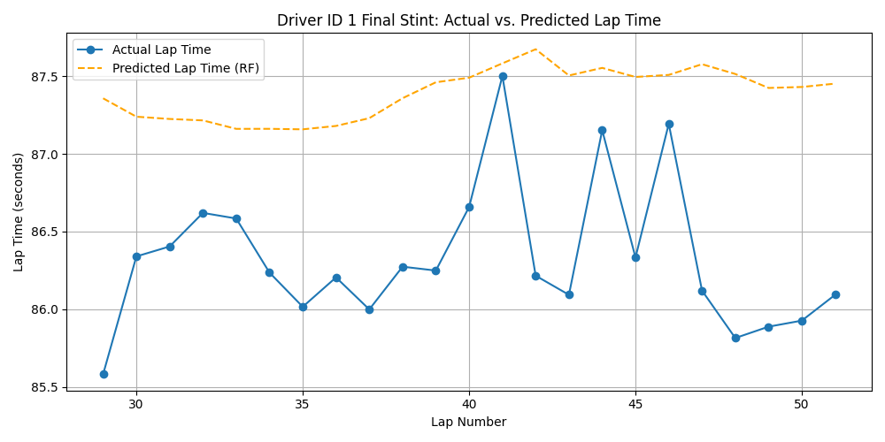

# F1 Lap Time Predictor

Predicts lap times within a single Formula 1 race using tire age, comparing
a baseline (grid position + lap number) against models that also know
tire age.

## Setup

1. Download the dataset from Kaggle: [Formula 1 World Championship (1950-2020+)](https://www.kaggle.com/datasets/rohanrao/formula-1-world-championship-1950-2020)
2. Place `races.csv`, `lap_times.csv`, `pit_stops.csv`, and `results.csv` in this folder.
3. `pip install -r requirements.txt`
4. Open and run all cells: `jupyter notebook f1laptimepredictor.ipynb`

## Race and drivers

Analysis is performed on the **2023 Italian Grand Prix (`raceId = 1112`) at Monza**. Weather reports and lap data confirm this race was fully dry with zero red flags or safety car periods to distort green-flag pace. The top 8 classified drivers who completed full race distance (`statusId = 1`) were selected to ensure clean, full stint data.

## Cleaning

Data cleaning removes two main artifacts:
1. **Pit Laps:** In-laps (entering pit lane) and immediate out-laps (exiting pit lane) were removed per driver to eliminate non-racing pace artifacts.
2. **Pace Outliers:** Laps exceeding 1.5x the driver's median lap time (e.g., blue flag delays) were removed.

A total of **16 outlier laps** were removed across the selected driver set.

## Feature: tire age

`tire_age` represents the number of laps completed on the current set of tires. It is calculated via direct subtraction relative to the preceding pit stop lap (`lap - stint_start`), ensuring it stays accurate and resets to zero after every pit stop regardless of any dropped or outlier laps.

## Split: stint-based, not random

To avoid data leakage, data is split temporally by stint rather than using a random split. Each driver's **final stint** is held out as the test set, while all earlier stints form the training set. This tests the model's ability to forecast future stint performance given historical race data.

## Models compared

- **Baseline** — Linear Regression on `grid` + `lap`.
- **Linear Regression (+Tire Age)** — Adds `tire_age` to baseline features.
- **Random Forest (+Tire Age)** — Non-linear regressor with `n_estimators=100` and `random_state=42` for exact reproducibility.

*Note on Feature Disambiguation:* Within a single stint, `lap` and `tire_age` increase linearly together. However, because training data spans multiple stints across drivers, the same `tire_age` value recurs at different absolute lap numbers, allowing the model to isolate tire degradation from overall race lap progression.

| Model | RMSE (s) | MAE (s) |
|---|---|---|
| Linear Regression (Baseline: grid+lap) | 0.858 | 0.750 |
| Linear Regression (+Tire Age) | 0.849 | 0.741 |
| Random Forest (+Tire Age) | 0.931 | 0.828 |

## Predicted vs actual — held-out stint

## Conclusion

Adding `tire_age` gives a small, measurable improvement over the baseline for Linear Regression (RMSE 0.858 → 0.849, roughly a 1% reduction) — a real but modest effect, consistent with Monza being one of the lowest-tire-wear circuits on the calendar. Random Forest performs slightly worse than the baseline (0.931), likely because it has enough flexibility to fit noise in a fairly small dataset (a handful of drivers, one race) rather than a genuine non-linear degradation curve. Within a single stint, `lap` and `tire_age` are closely correlated; they're only separable because the training data spans multiple stints where the same `tire_age` recurs at different `lap` numbers.

*Key limitations:*
1. The model does not explicitly account for fuel-burn weight reduction, which offsets tire degradation over time.
2. Compound types (Soft vs. Medium vs. Hard) are not differentiated in the standard timing data.
